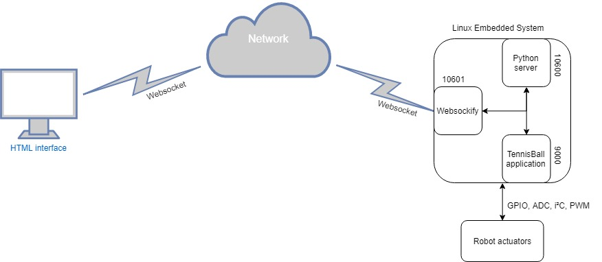

# bthesis-tennisball
<b> ARM based SemiAutonomous Tennis Balls collector </b>
 
This robot was part of my B.Tech thesis.  
The project's purpose is to collect the balls in a tennis court using a machine-vision system.  
 
Some technologies used are listed below.  
 
For robot/vision system:  
+ OpenCV computer-vision library  
+ Embedded Linux system in an ARM microcontroller  
+ Contrast Limited Adaptive Histogram Equalization - CLAHE   
+ Multi-threaded TCP server written in C language  
+ Simple Python TCP server to kill the machine-vision application and shutdown the system correctly.   

For the controller:  
+ Simple HTML/CSS interface  
+ Communication through Websockets via websockify  
  
<b>Project structure </b>
 

 
<b>Build Application </b>
 
Before build the tennisball_application, please check the dependencies in the Makefile.
 
You will need to setup some specific dependencies such as:
 
 
- OpenCV library  
- v4l2  
- pthread  
 
With the dependencies installed, run the command "make install" inside the root of "tennisball_application" folder. 
 
If you installed the dependencies correctly, you'll find the application binary inside "bin" folder.
  
<b> System Setup </b>
 
To run the application correctly, you must setup websockify, the Python server and configure the rc.local file in your Linux embedded system.
  
<b> Http Controller </b>
 
The tennisball_application received commands from a html controller through the use of the websockets technology. 
 
This is the reason you need to setup websockify in you Linux embedded system first. 
